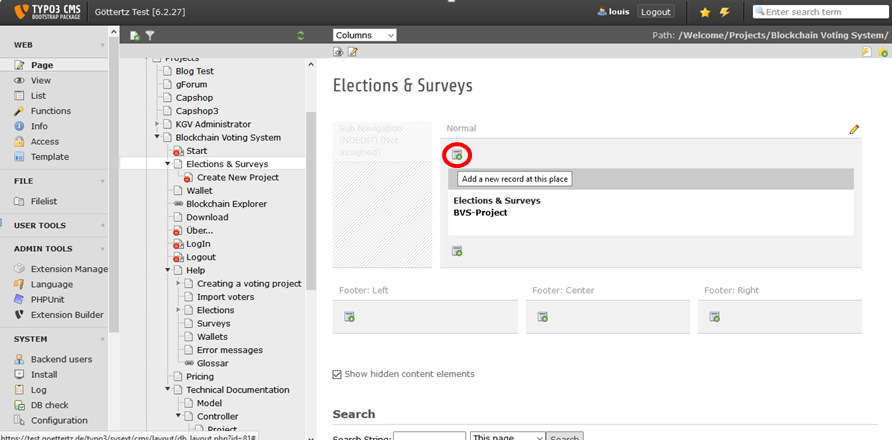
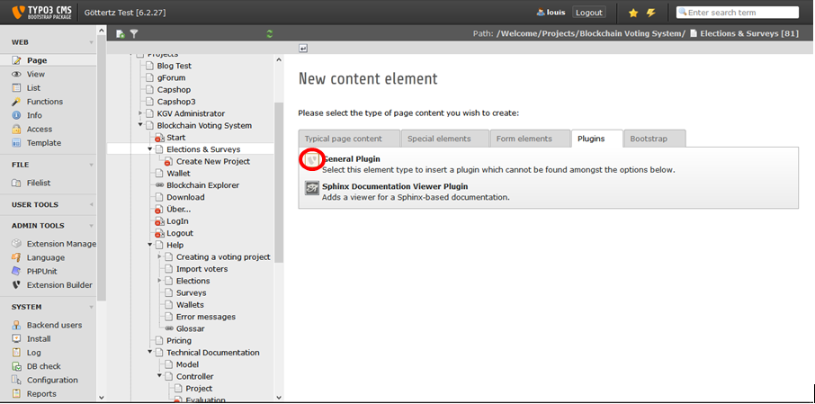
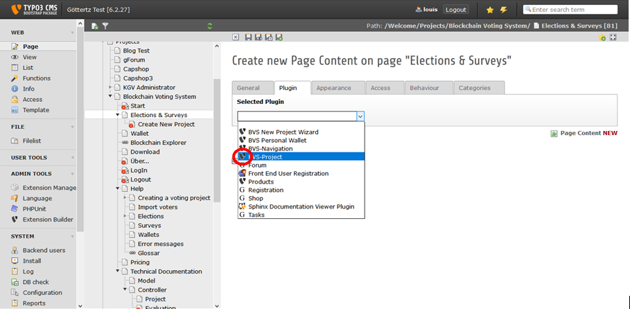

.. ==================================================
.. FOR YOUR INFORMATION
.. --------------------------------------------------
.. -*- coding: utf-8 -*- with BOM.

.. include:: ../Includes.txt

.. _users-manual:

Users manual
============

Target group: **Users**

Content:
--------

- Adding Project Plugin
- Configuring the Plugin

Adding Project Plugin
----------------------
In the backend navigate to the page that should contain the bc_voting content element. Click "Add":

	Default Backend view

	The Backend view of TYPO3 after the user has clicked on module "Page".

... and choose plugin from content type:

	Select Content Type

	The Backend view of TYPO3 after the user has clicked "Add" in page content module.

... and then general plugin -> BVS-Project from the selection list.

	Select Plugin

	The Backend view of TYPO3 after the user has clicked "Plugin"-Tab in new content module.

Configuring the Plugin
-----------------------

FAQ
^^^

Possible subsection: FAQ
